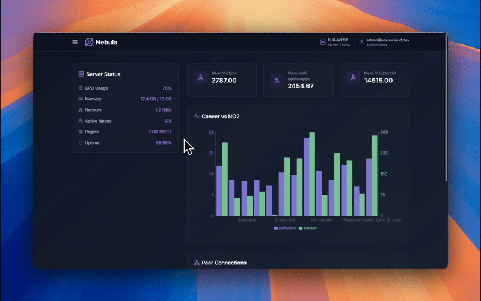

# **Nebula Federated Cloud**  

This project provides a mock **federated anlytics API and platform** and a **frontend interface** to predict lung cancer.

## **🚀 Getting Started**  

### **1️⃣ Backend (API) Setup**
#### **Prerequisites**
- Python **3.10+**
- `pip` (Python package manager)
- `bash` (for executing `.sh` scripts)

#### **Installation & Run**
```bash
cd api
pip install -r requirements.txt  # Install dependencies
bash launch_all_regions.sh       # Start the simulated different agents
```

### 2️⃣ Frontend Setup

Prerequisites

    Node.js 16+
    npm (Node Package Manager)

Installation & Run
```
cd front
npm install --legacy-peer-deps  # Install dependencies
npm run dev                     # Start the frontend
```

The frontend will run on http://localhost:5173 by default.

🛠️ Technologies Used

    Backend: Python, FastAPI
    Frontend: React, Next.js

📌 Notes

    Ensure the backend is running before starting the frontend.
    Modify API URLs in the frontend config if needed.


## **🔎 Concept Overview**
For a more detailed presentation refer to the folder presentation.

The goal of this project is to offer a federated platform to share information between different health and environemental actors.

The shared information will contain the needed information to train models without containing any PII.
For example we can allow hospitals to share the amount of patients with cancer, and correlate it to environmental data to train prediction models, and compute correlations.


